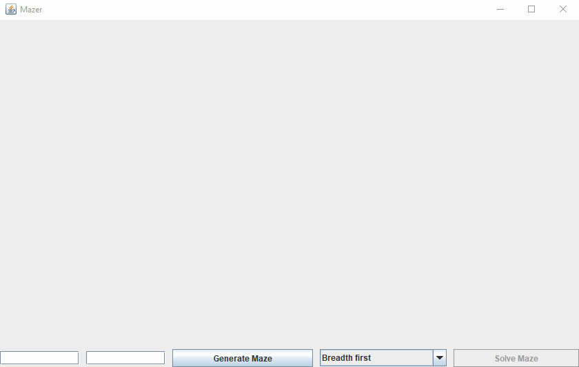
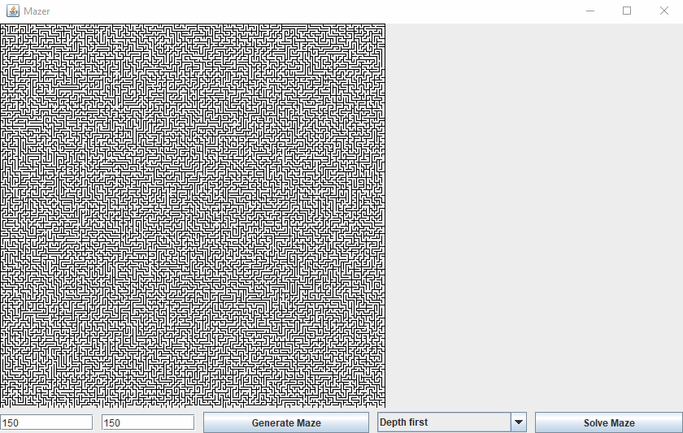

# MazeR

MazeR is a simple maze generator and solver.

### Run MazeR

To run MazeR, either import it in your IDE or build it with 'maven clean install' and run the created
jar-with-dependencies in target/ directory.

### Generation

To generate a maze, enter the maze dimensions, then press the button 'Generate Maze'.

### Solver

To solve a maze, select an algorithm, then press the button 'Solve Maze'. All explored cells will be colored in blue,
and expanding paths will be colored in red.
